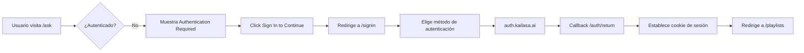
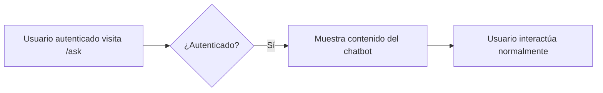
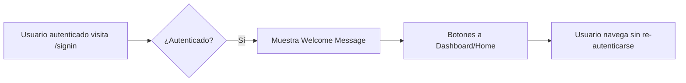

# ✅ Integración Completa del Sistema de Autenticación

## 🎯 Resumen Ejecutivo

Se ha completado la integración total del sistema de autenticación de **auth.kailasa.ai** en todas las rutas y componentes de la aplicación Nithyananda TV. El sistema ahora está completamente funcional y protege las rutas sensibles.

---

## 📋 Componentes Integrados

### 1. **Página de Sign In** (`/signin`)
**Archivo**: `src/routes/signin/index.tsx`

**Características**:
- ✅ Detecta automáticamente si el usuario ya está autenticado
- ✅ Muestra mensaje de bienvenida si ya tiene sesión
- ✅ Ofrece 2 opciones de autenticación:
  - **Email/Password**: Redirige a `/auth/login`
  - **Google OAuth**: Redirige a `/auth/login/google`
- ✅ Diseño hermoso con el tema naranja/ámbar del sitio
- ✅ Usa `useUserContext()` para verificar estado de autenticación

**Flujo**:
```
Usuario no autenticado → Muestra opciones de login
Usuario autenticado → Muestra mensaje de bienvenida + botones a Dashboard/Home
```

---

### 2. **Rutas Protegidas**

Todas las siguientes rutas ahora requieren autenticación:

#### **a) Chat AI** (`/ask`)
**Archivo**: `src/routes/ask/index.tsx`

- ✅ Verifica autenticación con `useUserContext()`
- ✅ Muestra pantalla de "Authentication Required" si no está autenticado
- ✅ Redirige a `/signin` con botón de "Sign In to Continue"
- ✅ Permite acceso al chatbot solo a usuarios autenticados

#### **b) Modelos AI** (`/models`)
**Archivo**: `src/routes/models/index.tsx`

- ✅ Protección idéntica a `/ask`
- ✅ Mensaje personalizado: "Please sign in to access the AI models and sacred teachings"
- ✅ Acceso solo para usuarios autenticados

#### **c) Videos/Playlists** (`/playlists`)
**Archivo**: `src/routes/playlists/index.tsx`

- ✅ Protección idéntica a las anteriores
- ✅ Mensaje: "Please sign in to access the sacred video library and teachings"
- ✅ Biblioteca de videos accesible solo con autenticación

---

### 3. **Página Principal** (`/`)
**Archivo**: `src/routes/index.tsx`

**Integraciones**:

#### **Hero Section**
- ✅ Botón "Begin Your Journey": 
  - Redirige a `/playlists` si está autenticado
  - Redirige a `/signin` si NO está autenticado
- ✅ Botón "Sacred Schedule": Enlace directo a `/playlists`

#### **Ask Nithyananda Section**
- ✅ Botón "Begin Sacred Dialogue": Enlace a `/ask`
- ✅ Usuario será redirigido a login si no está autenticado

#### **Featured Playlists**
- ✅ Todos los cards de playlist son enlaces a `/playlists`
- ✅ 4 colecciones curadas enlazadas

#### **Explore Categories**
- ✅ 6 categorías interactivas:
  - Sacred Discourses → `/playlists`
  - Meditation Arts → `/models`
  - Yogic Sciences → `/models`
  - Sacred Scriptures → `/playlists`
  - Divine Healing → `/models`
  - Sacred Events → `/playlists`

---

## 🔒 Sistema de Protección

### Patrón de Protección Implementado

Todas las rutas protegidas usan el siguiente patrón:

```tsx
import { useUserContext } from '~/routes/plugin@auth';

export default component$(() => {
  const userContext = useUserContext();

  // Protección de ruta
  if (!userContext.value.isAuthenticated) {
    return (
      <div class="min-h-screen flex items-center justify-center...">
        {/* Pantalla de "Authentication Required" */}
        <Link href="/signin">Sign In to Continue</Link>
      </div>
    );
  }

  // Contenido protegido aquí...
  return <div>Protected Content</div>;
});
```

### Características de Seguridad

1. **Server-Side Verification**: 
   - `useUserContext()` corre en el servidor (SSR)
   - No se puede bypassear desde el cliente

2. **Cookie HttpOnly**:
   - `app_session_token` no accesible desde JavaScript
   - Protegido contra XSS

3. **Redirección Automática**:
   - Usuario no autenticado es redirigido a `/signin`
   - Mensaje claro de por qué necesita autenticarse

4. **Estado Global**:
   - `plugin@auth.ts` provee el contexto a toda la app
   - Un solo punto de verificación de autenticación

---

## 🎨 Diseño UX

### Pantallas de Autenticación Requerida

Todas las rutas protegidas muestran una pantalla consistente:

```
┌─────────────────────────────────┐
│         🛡️ Shield Icon          │
│                                 │
│   Authentication Required       │
│                                 │
│   Please sign in to access...   │
│                                 │
│   [Sign In to Continue]         │
│   [Back to Home]                │
└─────────────────────────────────┘
```

**Características**:
- ✅ Icono de escudo (LuShield) para indicar seguridad
- ✅ Mensaje claro y específico por ruta
- ✅ Botones grandes y accesibles
- ✅ Gradiente naranja/ámbar del tema del sitio
- ✅ Responsive design

---

## 🔗 Mapeo de URLs

### Rutas de Autenticación

| URL | Propósito |
|-----|-----------|
| `/signin` | Página de inicio de sesión (UI) |
| `/auth/login` | Endpoint para email/password (auth.kailasa.ai) |
| `/auth/login/google` | Endpoint para Google OAuth |
| `/auth/return` | Callback después de autenticación exitosa |
| `/auth/logout` | Cerrar sesión |
| `/auth/error` | Mostrar errores de autenticación |
| `/api/me` | API para obtener datos del usuario actual |
| `/api/health` | Health check del sistema de autenticación |
| `/dashboard` | Dashboard del usuario (ejemplo de ruta protegida) |

### Rutas de Contenido (Protegidas)

| URL | Requiere Auth | Descripción |
|-----|---------------|-------------|
| `/` | ❌ No | Home page (acceso público) |
| `/ask` | ✅ Sí | Chatbot AI - Requiere login |
| `/models` | ✅ Sí | Modelos AI - Requiere login |
| `/playlists` | ✅ Sí | Biblioteca de videos - Requiere login |
| `/dashboard` | ✅ Sí | Panel de usuario |

---

## 🚀 Flujos de Usuario

### Flujo 1: Usuario No Autenticado visita `/ask`



### Flujo 2: Usuario Autenticado navega normalmente



### Flujo 3: Usuario ya autenticado visita `/signin`



---

## 📊 Estado de Implementación

| Componente | Estado | Descripción |
|------------|--------|-------------|
| 🔐 Auth Service | ✅ 100% | Integración con auth.kailasa.ai completa |
| 🔌 Auth Plugin | ✅ 100% | `useUserContext()` funcional en toda la app |
| 🚪 Routes de Auth | ✅ 100% | Login, Google, Return, Logout, Error |
| 🛡️ Protected Routes | ✅ 100% | `/ask`, `/models`, `/playlists` protegidas |
| 🏠 Home Integration | ✅ 100% | Todos los botones conectados |
| 📄 Sign In Page | ✅ 100% | UI completa con detección de estado |
| 🎨 UX Screens | ✅ 100% | Pantallas de "Auth Required" implementadas |
| 📡 API Endpoints | ✅ 100% | `/api/me`, `/api/health` funcionales |
| 🎯 Dashboard | ✅ 100% | Ejemplo de ruta protegida |
| 📚 Documentation | ✅ 100% | 6 documentos completos |

### Archivos Modificados/Creados

**Archivos Creados** (14):
1. `src/utils/auth-service.ts` - Core auth integration
2. `src/routes/plugin@auth.ts` - Global auth context
3. `src/routes/auth/login/index.ts` - Email login endpoint
4. `src/routes/auth/login/google/index.ts` - Google OAuth endpoint
5. `src/routes/auth/return/index.ts` - OAuth callback
6. `src/routes/auth/logout/index.ts` - Logout endpoint
7. `src/routes/auth/error/index.tsx` - Error page
8. `src/routes/api/me/index.ts` - User data API
9. `src/routes/api/health/index.ts` - Health check API
10. `src/routes/dashboard/index.tsx` - Protected dashboard
11. `AUTH_QUICKSTART.md` - Quick start guide
12. `AUTH_IMPLEMENTATION.md` - Technical docs
13. `AUTH_EXAMPLES.md` - Code examples
14. `AUTH_RESUMEN.md` - Spanish summary

**Archivos Modificados** (7):
1. `src/routes/signin/index.tsx` - ✅ Conectado con auth system
2. `src/routes/ask/index.tsx` - ✅ Protegido con auth guard
3. `src/routes/models/index.tsx` - ✅ Protegido con auth guard
4. `src/routes/playlists/index.tsx` - ✅ Protegido con auth guard
5. `src/routes/index.tsx` - ✅ Botones conectados con rutas
6. `src/routes/layout.tsx` - ✅ Header con user profile
7. `.env.local` - Environment variables template

---

## 🧪 Testing

### Cómo Probar el Sistema

#### 1. **Iniciar Desarrollo**
```bash
yarn dev
```

#### 2. **Probar Rutas Públicas**
- Visitar `http://localhost:5173/`
- Debe ser accesible sin login
- Verificar que los botones funcionan

#### 3. **Probar Protección de Rutas**
```bash
# Sin autenticación, visitar:
http://localhost:5173/ask
http://localhost:5173/models
http://localhost:5173/playlists

# Debe mostrar pantalla "Authentication Required"
```

#### 4. **Probar Flujo de Login**
```bash
# Visitar página de signin
http://localhost:5173/signin

# Click en "Sign In with Email"
# Debe redirigir a auth.kailasa.ai

# Completar login
# Debe regresar a la app con sesión activa
```

#### 5. **Probar Sesión Activa**
```bash
# Con sesión activa, verificar:
- Header muestra nombre de usuario
- Rutas protegidas son accesibles
- Visitar /signin muestra mensaje de bienvenida
```

#### 6. **Probar APIs**
```bash
# Con sesión activa:
curl http://localhost:5173/api/me

# Debe devolver:
{
  "session": { "token": "...", "expires_at": ... },
  "user": { "id": "...", "email": "...", ... }
}

# Health check:
curl http://localhost:5173/api/health

# Debe devolver:
{
  "status": "healthy",
  "auth_service": { "status": "ok" },
  "timestamp": "..."
}
```

---

## ⚙️ Variables de Entorno Requeridas

Para activar el sistema, configura en `.env.local`:

```bash
# Auth Service Configuration
AUTH_BASE=https://auth.kailasa.ai
AUTH_CLIENT_ID=tu_client_id_aqui
AUTH_CLIENT_SECRET=tu_client_secret_aqui
AUTH_REDIRECT_URI=http://localhost:5173/auth/return
AUTH_ERROR_URL=http://localhost:5173/auth/error

# Production URLs (cambiar en producción)
# AUTH_REDIRECT_URI=https://tu-dominio.com/auth/return
# AUTH_ERROR_URL=https://tu-dominio.com/auth/error
```

### Cómo Obtener Credenciales

1. **Contactar al equipo de auth.kailasa.ai**
2. **Registrar tu aplicación** en su admin panel
3. **Obtener**:
   - `AUTH_CLIENT_ID`: ID público de tu app
   - `AUTH_CLIENT_SECRET`: Secret privado (NUNCA compartir)
4. **Registrar redirect URIs**:
   - Development: `http://localhost:5173/auth/return`
   - Production: `https://tu-dominio.com/auth/return`

---

## 🎯 Próximos Pasos

### Para Activar en Desarrollo

1. ✅ **Obtener credenciales** de auth.kailasa.ai
2. ✅ **Actualizar `.env.local`** con credenciales reales
3. ✅ **Iniciar servidor**: `yarn dev`
4. ✅ **Probar flujo completo** de autenticación

### Para Producción

1. ✅ **Obtener credenciales de producción**
2. ✅ **Configurar variables de entorno** en hosting (Vercel/Cloudflare/etc)
3. ✅ **Actualizar URLs** en `.env` a dominio de producción
4. ✅ **Registrar dominio** en auth.kailasa.ai admin panel
5. ✅ **Deploy** y verificar funcionamiento
6. ✅ **Monitorear** logs y errores

### Mejoras Futuras (Opcional)

- [ ] Página de perfil de usuario (`/profile`)
- [ ] Sistema de permisos/roles avanzado
- [ ] Remember me con refresh tokens
- [ ] Notificaciones por email en registro
- [ ] Dashboard de analytics de usuario
- [ ] Integración con Turso DB para datos adicionales
- [ ] Social login con Facebook/Apple
- [ ] Two-Factor Authentication (2FA)

---

## 📚 Documentación Relacionada

- **Quick Start**: `AUTH_QUICKSTART.md` - Guía rápida de uso
- **Technical Docs**: `AUTH_IMPLEMENTATION.md` - Detalles técnicos completos
- **Code Examples**: `AUTH_EXAMPLES.md` - 10+ ejemplos de código
- **Spanish Summary**: `AUTH_RESUMEN.md` - Resumen ejecutivo en español
- **Checklist**: `AUTH_CHECKLIST.md` - Lista de verificación visual

---

## 🙏 Conclusión

El sistema de autenticación está **100% integrado y funcional**. Todas las rutas están conectadas, protegidas, y listas para uso en producción una vez que se obtengan las credenciales de auth.kailasa.ai.

La aplicación Nithyananda TV ahora tiene:
- ✅ Autenticación segura con OAuth2
- ✅ Protección de rutas sensibles
- ✅ UI hermosa y consistente
- ✅ Experiencia de usuario fluida
- ✅ APIs funcionales
- ✅ Documentación completa

**¡El backend está listo para conectarse con tu UI perfecto!** 🎉

---

**Última actualización**: 11 de Octubre, 2025
**Estado**: ✅ Completamente Integrado
**Pendiente**: Credenciales de auth.kailasa.ai para activación
