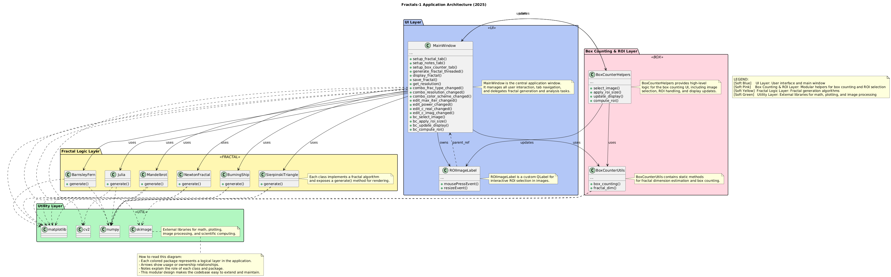
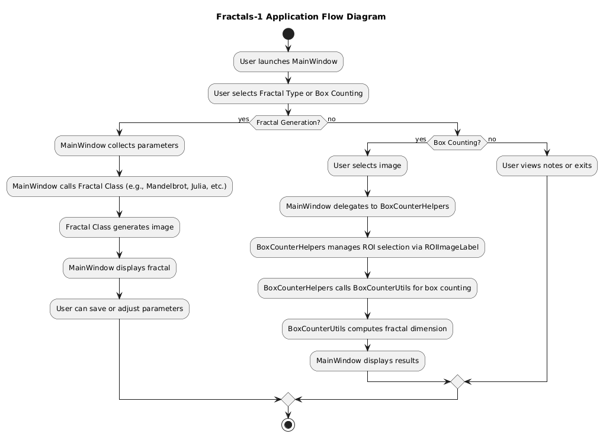
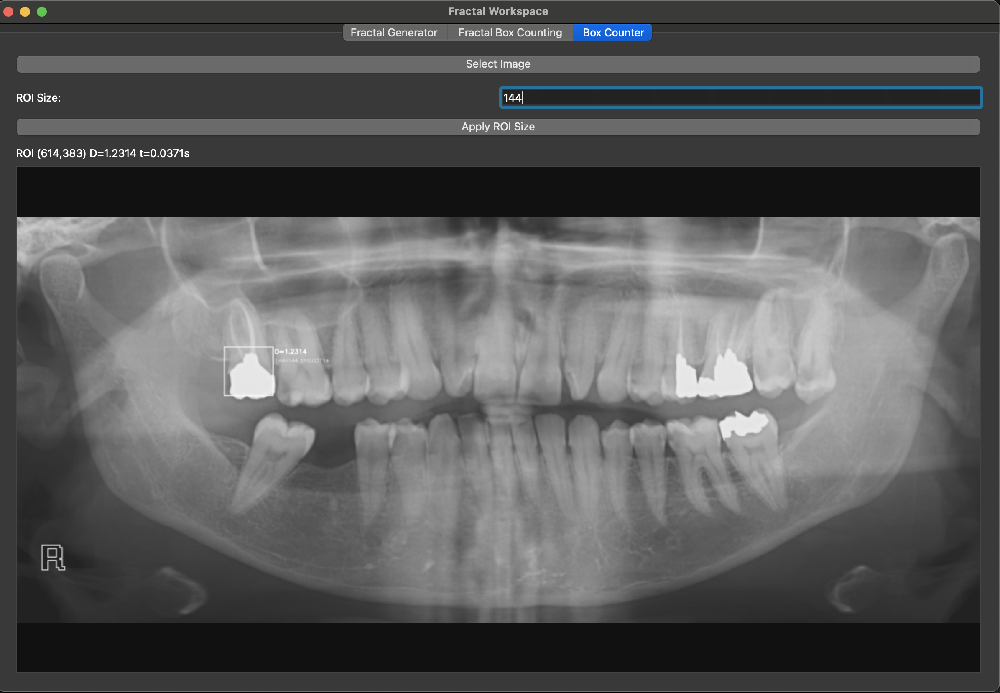
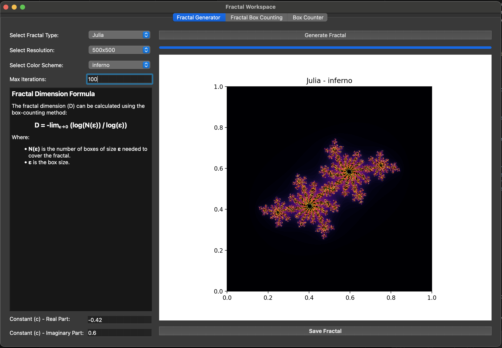

# Fractal Workspace: Interactive Fractal Generator & Analyzer


## Architecture Diagram



## Application Flow Diagram




This project is a Python application for generating, visualizing, and analyzing fractals. It features a modern, interactive GUI and advanced tools for fractal dimension analysis using box counting.

## Project Structure


```text

## Features


- **Interactive GUI**: Generate, visualize, and analyze fractals in a user-friendly interface.
- **Multiple Fractal Types**: Mandelbrot, Julia, Burning Ship, Newton, Barnsley Fern, Sierpinski Triangle.
- **Customizable Parameters**: Resolution, color scheme, iterations, and fractal-specific parameters.
- **Box Counting Tool**: Select a region of interest (ROI) in any image and compute its fractal dimension using the box counting method.
- **ROI Selection**: Click on the image to select the top-left corner of the ROI for analysis.
- **Save Fractals**: Export generated fractals as PNG images.
- **Notes & Formulas**: Built-in notes area and reference for fractal dimension formulas.
- **Modular Codebase**: All box counting logic and ROI image handling are modularized in the `boxcounting/` package for maintainability and reuse.

## Quick Start


```bash

## Prerequisites & Dependencies


- Python 3.8 or higher
- pip (Python package manager)
- PyQt6
- numpy
- matplotlib
- opencv-python
- scikit-image
- markdown (for wiki tab rendering)

All dependencies are listed in [requirements.txt](requirements.txt).


## Usage

To run the application, execute:


```bash

### Main Tabs

- **Fractal Generator**: Select fractal type, adjust parameters, and generate fractals.
- **Fractal Box Counting**: Take notes and view fractal dimension formulas.
- **Box Counter**: Load an image, set ROI size, click to select ROI, and compute fractal dimension.

### Box Counting Workflow

1. Go to the **Box Counter** tab.
2. Click **Select Image** and choose a grayscale image.
3. Enter the ROI size (e.g., 128) and click **Apply ROI Size**.
4. Click on the image to select the top-left corner of the ROI.
5. The fractal dimension and computation time will be displayed.

## Example Output


### Radio Image/Box Counter UI Example



### Example Fractal Output



## Contributing

Contributions are welcome! Please read the [CONTRIBUTING.md](CONTRIBUTING.md) and [CODE_OF_CONDUCT.md](CODE_OF_CONDUCT.md) before submitting issues or pull requests.

### How to Contribute

1. Fork the repository.
2. Create a new branch for your feature or bug fix:

   ```bash
   git checkout -b feature/your-feature-name
   ```

3. Commit your changes:

   ```bash
   git commit -m "Add your commit message here"
   ```

4. Push to your branch:

   ```bash
   git push origin feature/your-feature-name
   ```

5. Open a pull request.

## Troubleshooting

- **PyQt6 install issues**: Ensure you are using Python 3.8+ and a clean virtual environment. Try `pip install --upgrade pip` before installing requirements.
- **MathJax formulas not rendering**: The wiki tab uses MathJax via CDN. Ensure you have an internet connection for formulas to display.
- **UI scaling issues**: On high-DPI displays, set the `QT_SCALE_FACTOR=1` environment variable if needed.

## Acknowledgments

This project is inspired by the [Python Fractal Generator](https://github.com/lahkopo/Python-Fractal-Generator) by [lahkopo](https://github.com/lahkopo). Special thanks to the original author and all contributors.

## License

This project is licensed under the MIT License. See the [LICENSE](LICENSE) file for details.

## Project Structure

```
fractal-box-counter/
├── boxcounting/
│   ├── __init__.py
│   ├── box_counter_helpers.py
│   ├── box_counter_utils.py
│   └── roi_image_label.py
├── fractals/
│   ├── __init__.py
│   ├── barnsley_fern.py
│   ├── burning_ship.py
│   ├── julia.py
│   ├── mandelbrot.py
│   ├── newton.py
│   └── sierpinski_triangle.py
├── images/
├── ui.py
├── requirements.txt
├── design.puml
└── README.md
```

## Features

- **Interactive GUI**: Generate, visualize, and analyze fractals in a user-friendly interface.
- **Multiple Fractal Types**: Mandelbrot, Julia, Burning Ship, Newton, Barnsley Fern, Sierpinski Triangle.
- **Customizable Parameters**: Resolution, color scheme, iterations, and fractal-specific parameters.
- **Box Counting Tool**: Select a region of interest (ROI) in any image and compute its fractal dimension using the box counting method.
- **ROI Selection**: Click on the image to select the top-left corner of the ROI for analysis.
- **Save Fractals**: Export generated fractals as PNG images.
- **Notes & Formulas**: Built-in notes area and reference for fractal dimension formulas.
- **Modular Codebase**: All box counting logic and ROI image handling are modularized in the `boxcounting/` package for maintainability and reuse.


## Quick Start


```bash
git clone <replace-with-your-repository-url>
cd fractal-box-counter
python3 -m venv venv
source venv/bin/activate
pip install -r requirements.txt
python ui.py
```

## Prerequisites & Dependencies

- Python 3.8 or higher
- pip (Python package manager)
- PyQt6
- numpy
- matplotlib
- opencv-python
- scikit-image
- markdown (for wiki tab rendering)

All dependencies are listed in [requirements.txt](requirements.txt).


## Usage

To run the application, execute:

```bash
python ui.py
```


### Main Tabs

- **Fractal Generator**: Select fractal type, adjust parameters, and generate fractals.
- **Fractal Box Counting**: Take notes and view fractal dimension formulas.
- **Box Counter**: Load an image, set ROI size, click to select ROI, and compute fractal dimension.


### Box Counting Workflow

1. Go to the **Box Counter** tab.
2. Click **Select Image** and choose a grayscale image.
3. Enter the ROI size (e.g., 128) and click **Apply ROI Size**.
4. Click on the image to select the top-left corner of the ROI.
5. The fractal dimension and computation time will be displayed.


## Example Output


### Radio Image/Box Counter UI Example


### Example Fractal Output


## Contributing

Contributions are welcome! Please read the [CONTRIBUTING.md](CONTRIBUTING.md) and [CODE_OF_CONDUCT.md](CODE_OF_CONDUCT.md) before submitting issues or pull requests.


### How to Contribute

1. Fork the repository.
2. Create a new branch for your feature or bug fix:

   ```bash
   git checkout -b feature/your-feature-name
   ```

3. Commit your changes:

   ```bash
   git commit -m "Add your commit message here"
   ```

4. Push to your branch:

   ```bash
   git push origin feature/your-feature-name
   ```

5. Open a pull request.


