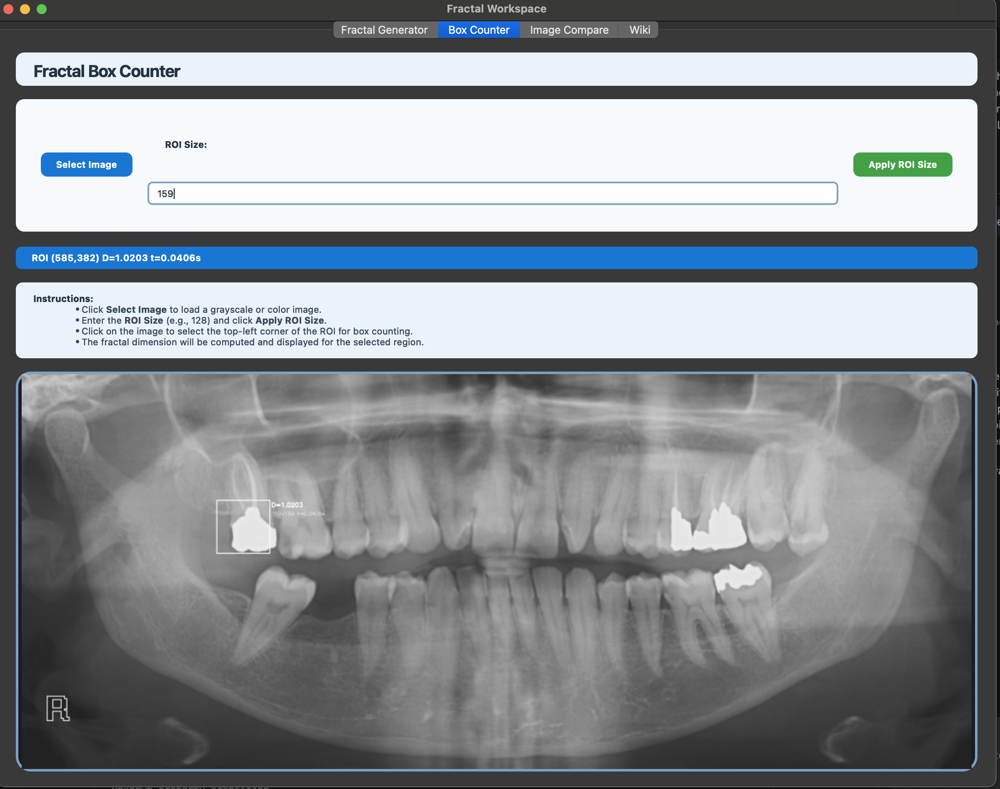

# 🧩 Fractal Workspace: Interactive Fractal Generator & Analyzer

<p align="center">
  
  
  
</p>

<p align="center" style="font-size:1.1em;">
   <b>Generate, visualize, and analyze fractals with a beautiful, modern Python app.</b><br>
   <i>For students, teachers, researchers, and anyone curious about fractals!</i>
</p>

<p align="center">
   
   
   
</p>

## Table of Contents

- [🧩 Fractal Workspace: Interactive Fractal Generator \& Analyzer](#-fractal-workspace-interactive-fractal-generator--analyzer)
  - [Table of Contents](#table-of-contents)
  - [🚀 Demo \& Screenshots](#-demo--screenshots)
  - [✨ Features at a Glance](#-features-at-a-glance)
  - [](#)
  - [Features](#features)
  - [👤 Who is this for?](#-who-is-this-for)
  - [🏁 Quick Start](#-quick-start)
  - [📦 Prerequisites \& Dependencies](#-prerequisites--dependencies)
  - [🖥️ Usage](#️-usage)
    - [Main Tabs](#main-tabs)
    - [Box Counting Workflow](#box-counting-workflow)
  - [📚 Advanced Topics \& Wiki](#-advanced-topics--wiki)
  - [🗂️ Project Structure](#️-project-structure)
  - [🤝 Contributing](#-contributing)
    - [How to Contribute](#how-to-contribute)
  - [🛠️ Troubleshooting](#️-troubleshooting)
  - [❓ FAQ](#-faq)
  - [🙏 Acknowledgments](#-acknowledgments)
  - [📝 License](#-license)
  - [📬 Contact / Maintainer](#-contact--maintainer)


---


## 🚀 Demo & Screenshots


| <b>Fractal Generator</b> | <b>Box Counter</b> | <b>Compare & Analysis</b> |
|:------------------------:|:-----------------:|:------------------------:|
|  |  |  |


<details>
<summary>🔎 <b>Sample Analysis Output</b> (click to expand)</summary>

<p align="center">
   
</p>
</details>


## ✨ Features at a Glance

- 🎨 **Interactive GUI**: User-friendly PyQt6 interface for generating and exploring fractals.
- 🧮 **Multiple Fractal Types**: Mandelbrot, Julia, Burning Ship, Newton, Barnsley Fern, Sierpinski Triangle.
- 🧩 **Box Counting Tool**: Select a region of interest (ROI) and compute its fractal dimension.

<div align="right" style="font-size:0.95em; margin-top:8px; margin-bottom:8px;">
<a href="#table-of-contents">⬆️ Back to Table of Contents</a>
</div>
---

## Features

- **Interactive GUI**: Generate, visualize, and analyze fractals in a user-friendly interface.
- **Multiple Fractal Types**: Mandelbrot, Julia, Burning Ship, Newton, Barnsley Fern, Sierpinski Triangle.
- **Customizable Parameters**: Resolution, color scheme, iterations, and fractal-specific parameters.
- **Box Counting Tool**: Select a region of interest (ROI) in any image and compute its fractal dimension using the box counting method.
- **ROI Selection**: Click on the image to select the top-left corner of the ROI for analysis.
- **Save Fractals**: Export generated fractals as PNG images.
- **Notes & Formulas**: Built-in notes area and reference for fractal dimension formulas.
- **Modular Codebase**: All box counting logic and ROI image handling are modularized in the `boxcounting/` package for maintainability and reuse.

---


## 👤 Who is this for?

> **Students & Teachers**: Explore fractals and their math visually.
> 
> **Researchers**: Analyze fractal dimension in scientific and medical images.
> 
> **Curious Minds**: Just want to play with beautiful math? This is for you!

<div align="right" style="font-size:0.95em; margin-top:8px; margin-bottom:8px;">
<a href="#table-of-contents">⬆️ Back to Table of Contents</a>
</div>


- **All-in-one fractal exploration**: Generate, visualize, and analyze a wide variety of fractals in one app.
- **Educational**: Great for students, teachers, and researchers in mathematics, physics, and neuroscience.
- **Research-Ready**: Includes tools for fractal dimension analysis, useful in medical imaging and scientific research.
- **Modern UX**: Clean, accessible, and responsive PyQt6 interface with tooltips and error dialogs.
- **Open Source**: MIT licensed, well-documented, and easy to contribute to.

---


## 🏁 Quick Start


```bash
git clone https://github.com/aartisr/fractals.git
cd fractals-1
python3 -m venv venv
source venv/bin/activate
pip install -r requirements.txt
python ui.py
```

<details>
<summary>💡 <b>Tip: Having trouble?</b></summary>

- Make sure you’re using Python 3.8+.
- Try `pip install --upgrade pip` if you have install issues.
- See the [Troubleshooting](#troubleshooting) section below.
</details>

<div align="right" style="font-size:0.95em; margin-top:8px; margin-bottom:8px;">
<a href="#table-of-contents">⬆️ Back to Table of Contents</a>
</div>


---

## 📦 Prerequisites & Dependencies

- Python 3.8 or higher
- pip (Python package manager)
- PyQt6
- numpy
- matplotlib
- opencv-python
- scikit-image
- markdown (for wiki tab rendering)


All dependencies are listed in [requirements.txt](requirements.txt).


<div align="right" style="font-size:0.95em; margin-top:8px; margin-bottom:8px;">
<div align="right" style="font-size:0.95em; margin-top:8px; margin-bottom:8px;">
<a href="#table-of-contents">⬆️ Back to Table of Contents</a>
</div>
</div>

---

## 🖥️ Usage


To run the application:

```bash
python ui.py
```


### Main Tabs

- **Fractal Generator**: Select fractal type, adjust parameters, and generate fractals.
- **Fractal Box Counting**: Take notes and view fractal dimension formulas.
- **Box Counter**: Load an image, set ROI size, click to select ROI, and compute fractal dimension.


### Box Counting Workflow

<ol>
   <li>Go to the <b>Box Counter</b> tab.</li>
   <li>Click <b>Select Image</b> and choose a grayscale image.</li>
   <li>Enter the ROI size (e.g., 128) and click <b>Apply ROI Size</b>.</li>
   <li>Click on the image to select the top-left corner of the ROI.</li>
   <li>The fractal dimension and computation time will be displayed.</li>
</ol>


<div align="right" style="font-size:0.95em; margin-top:8px; margin-bottom:8px;">
<div align="right" style="font-size:0.95em; margin-top:8px; margin-bottom:8px;">
<a href="#table-of-contents">⬆️ Back to Table of Contents</a>
</div>
</div>

---

## 📚 Advanced Topics & Wiki

- [Fractals in Medical Imaging](wiki/Fractals-in-Medical-Imaging.md)
- [Box Counting Method](wiki/Box-Counting-Method.md)
- [Fractal Types and Equations](wiki/Fractal-Types-and-Equations.md)
- [Stepwise Box Counting Comparison](wiki/Box-Counting-Comparison-Stepwise.md)

<div align="right" style="font-size:0.95em; margin-top:8px; margin-bottom:8px;">
<div align="right" style="font-size:0.95em; margin-top:8px; margin-bottom:8px;">
<a href="#table-of-contents">⬆️ Back to Table of Contents</a>
</div>
</div>

---


---

## 🗂️ Project Structure

```text
fractal-box-counter/
├── boxcounting/
│   ├── __init__.py
│   ├── box_counter_helpers.py
│   ├── box_counter_utils.py
│   └── roi_image_label.py
├── fractals/
│   ├── __init__.py
│   ├── barnsley_fern.py
│   ├── burning_ship.py
│   ├── julia.py
│   ├── mandelbrot.py
│   ├── newton.py
│   └── sierpinski_triangle.py
├── images/
├── ui.py
├── requirements.txt
├── design.puml
└── README.md
```

<div align="right" style="font-size:0.95em; margin-top:8px; margin-bottom:8px;">
<div align="right" style="font-size:0.95em; margin-top:8px; margin-bottom:8px;">
<a href="#table-of-contents">⬆️ Back to Table of Contents</a>
</div>
</div>

---


---

## 🤝 Contributing

Contributions are welcome! Please read the [CONTRIBUTING.md](CONTRIBUTING.md) and [CODE_OF_CONDUCT.md](CODE_OF_CONDUCT.md) before submitting issues or pull requests.

### How to Contribute

1. Fork the repository.
2. Create a new branch for your feature or bug fix:

   ```bash
   git checkout -b feature/your-feature-name
   ```

3. Commit your changes:

   ```bash
   git commit -m "Add your commit message here"
   ```

4. Push to your branch:

   ```bash
   git push origin feature/your-feature-name
   ```

5. Open a pull request.

<div align="right" style="font-size:0.95em; margin-top:8px; margin-bottom:8px;">
<div align="right" style="font-size:0.95em; margin-top:8px; margin-bottom:8px;">
<a href="#table-of-contents">⬆️ Back to Table of Contents</a>
</div>
</div>

---


---

## 🛠️ Troubleshooting

- **PyQt6 install issues**: Ensure you are using Python 3.8+ and a clean virtual environment. Try `pip install --upgrade pip` before installing requirements.
- **MathJax formulas not rendering**: The wiki tab uses MathJax via CDN. Ensure you have an internet connection for formulas to display.
- **UI scaling issues**: On high-DPI displays, set the `QT_SCALE_FACTOR=1` environment variable if needed.

<div align="right" style="font-size:0.95em; margin-top:8px; margin-bottom:8px;">
<div align="right" style="font-size:0.95em; margin-top:8px; margin-bottom:8px;">
<a href="#table-of-contents">⬆️ Back to Table of Contents</a>
</div>
</div>

---


---

## ❓ FAQ

**Q: Can I use this for research or teaching?**  
A: Yes! The app is designed for both educational and research use, with modular code and clear documentation.

**Q: How do I add a new fractal type?**  
A: Add a new Python file in the `fractals/` directory and update the UI dropdown in `ui.py`.

**Q: Does it work on Windows, Mac, and Linux?**  
A: Yes, it is cross-platform. Just ensure you have Python 3.8+ and the required dependencies.

**Q: Where can I learn more about fractals and box counting?**  
A: See the [Advanced Topics & Wiki](#advanced-topics--wiki) section or the in-app wiki tab.

<div align="right" style="font-size:0.95em; margin-top:8px; margin-bottom:8px;">
<div align="right" style="font-size:0.95em; margin-top:8px; margin-bottom:8px;">
<a href="#table-of-contents">⬆️ Back to Table of Contents</a>
</div>
</div>

---


---

## 🙏 Acknowledgments

This project is inspired by the [Python Fractal Generator](https://github.com/lahkopo/Python-Fractal-Generator) by [lahkopo](https://github.com/lahkopo). Special thanks to the original author and all contributors.

Portions of the box counting and analysis workflow are also inspired by [semruktech/fractal-box-counter](https://github.com/semruktech/fractal-box-counter.git).

<div align="right" style="font-size:0.95em; margin-top:8px; margin-bottom:8px;">
<div align="right" style="font-size:0.95em; margin-top:8px; margin-bottom:8px;">
<a href="#table-of-contents">⬆️ Back to Table of Contents</a>
</div>
</div>

---


---

## 📝 License

This project is licensed under the MIT License. See the [LICENSE](LICENSE) file for details.

<div align="right" style="font-size:0.95em; margin-top:8px; margin-bottom:8px;">
<div align="right" style="font-size:0.95em; margin-top:8px; margin-bottom:8px;">
<a href="#table-of-contents">⬆️ Back to Table of Contents</a>
</div>
</div>

---


---

## 📬 Contact / Maintainer

For questions, suggestions, or feedback, please open an issue or contact [Aarti Sri Ravikumar](https://github.com/aartisr).

<div align="right" style="font-size:0.95em; margin-top:8px; margin-bottom:8px;">
<div align="right" style="font-size:0.95em; margin-top:8px; margin-bottom:8px;">
<a href="#table-of-contents">⬆️ Back to Table of Contents</a>
</div>
</div>


